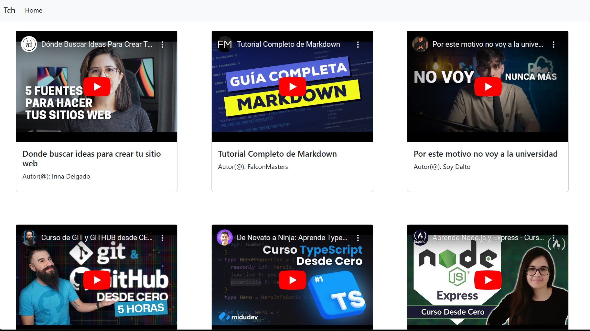

# Cursos-Gratis

Este proyecto es un sitio web con diferentes secciones para estudiantes autodidactas de programación pero el sitio no se queda alli el sitio esta pensado para dar a los usuarios un poco de conocimiento de forma gratuita por ejemplo hay gias para una sección en especifico como seria la gia de desarrollo front end y otra que no va de tecnologia si no de organización que seria la de notion.

## Installation

~Clone this repository

```
git clone https://github.com/luisangelponcealvarez/cursos-gratis.git
```

~Install dependencies (make sure you are in the root of this repository)

```
npm install
```

~Starting server on port 3000

```
npm run dev
```

[Ver el sitio](https://cursos-gratis.netlify.app/)

## Miniatura



### Para colaborar en el proyecto

Si quieres colaborar mandarme un mensaje a mi sitio de [Contacto](https://luisangelponcealvarez.netlify.app/Contact)
para añadirlos mostrar les la organización para hacer tareas etc y llevar las a cabo.
